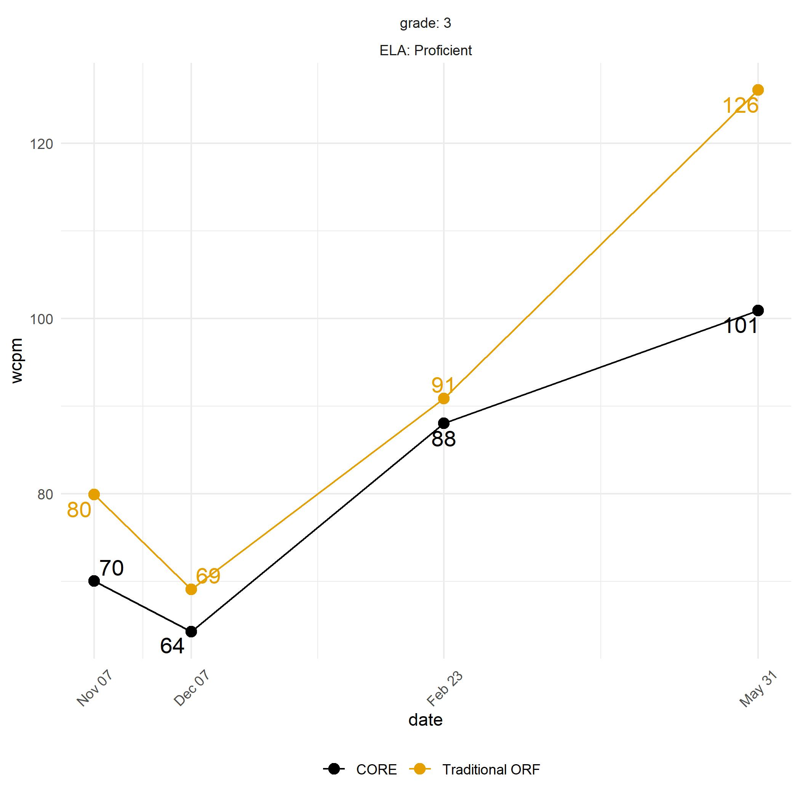

```{r setup, include=FALSE}
knitr::opts_chunk$set(echo = TRUE)

library(tidyverse)
library(dplyr)
library(qualtRics)
library(here)
library(readxl)
library(knitr)
library(RColorBrewer)
library(ggthemes)

theme_set(theme_minimal())
```

```{r data, echo = FALSE}
qualtrics_api_credentials(api_key = "RLPk714vkWXUHfT5uv5fm0hSyk0a3PBO5t8ouoAR", 
                          base_url = "oregon.qualtrics.com",
                          install = TRUE,
                          overwrite = TRUE)

readRenviron("~/.Renviron")

surveys <- all_surveys()

qual_raw_g3 <- fetch_survey(surveyID = pull(filter(surveys, name == "Grade3_Focus-Group-Survey"), id), 
                            force_request = TRUE)
```


```{r rename_variables, echo = FALSE}
rename_fx <- function(x){
  df <- x %>% 
    slice(1:2)
  as_tibble(cbind(qual = names(df), t(df))) %>% 
    select(qual, new = V2, original = V3)}

lookup <- tibble(
  sheet = paste("Figure", c(1:4)),
  data = map(sheet, ~read_xlsx(here("data", "Grade3_Focus-Group-Survey_January 19 2021_15.26.xlsx"),
                              sheet = .)),
  dta = map(data, ~rename_fx(.))) %>% 
  select(dta) %>% 
  unnest(cols = c(dta)) %>% 
  mutate(new = str_to_lower(new))

final_g3_data <- qual_raw_g3 %>% 
  select_if(names(qual_raw_g3) %in% lookup$qual) %>% 
  pivot_longer(
    cols = everything(),
    names_to = "qual",
    values_to = "values"
  ) %>%
  left_join(lookup) %>% 
  select(new, values) %>% 
  pivot_wider(
    names_from = new,
    values_from = values
  ) %>% 
  unnest(cols = everything())
```


```{r recode, echo = FALSE}

final_g3_data <- final_g3_data %>% 
  mutate(across(ends_with("reading_level"), ~fct_expand(.x, "Above grade level", "At grade level", "Below grade level")),
         across(ends_with("at_risk"), ~recode(.x, "Not enough information" = "Not enough information (Please specify what other data would you like to see for this student)")),
         across(ends_with("at_risk"), ~fct_expand(.x, "Yes", "No", "Not enough information")),
         across(matches("pm|trust|sbac|last|first|better"), ~recode(.x, "CORE (Black)" = "Black", "Traditional (Yellow)" = "Yellow")),
         across(matches("pm|trust|sbac|last|first|better"), ~fct_expand(.x,
           "CORE (Black)", "Traditional (Yellow)", "No difference between the two lines", "I don't know")),
         across(matches("yellow_line|black_line"), ~fct_expand(.x, "It appears the intervention is working for the student", "It appears the intervention is NOT working for the student", "I cannot tell whether the intervention is working or not")),
         across(ends_with("shading"), ~fct_expand(.x, "I am very familiar with this concept", "I am a little familiar with this concept", "I am a little unfamiliar with this concept", "I am very unfamiliar with this concept")),
         across(ends_with("measurement_error"), ~fct_expand(.x, "Yes", "No")),
         across(ends_with("shaded_area"), ~fct_expand(.x, "Yes", "No", "I still don’t understand the shaded area"))) 

```

#Introduction


#Global Questions

The figure below shows the same data you have just seen, but in a different way. Now, the lines are in separate graphs, and each is surrounded by gray shading. The shaded area represents the area that we think contains the students true score. This is sometimes called the measurement error.

The less measurement error, the better, because that means the score is more accurate. That is, the score better reflects the students "true ORF ability." So the smaller the gray shaded area, the better. 

When you and your peers discuss student data (for example, in school teams), do you discuss measurement error, or whether the data is accurate, or whether the data reflects what the student can do?
```{r globalquestions}

#should probably word smith the above - I copied it verbatim from the survey

#bar graph with two columns one for shading and one for measurement_error

```

The figures that follow are from a third grade student that participated in the 2018-2019 study. Three teachers answered a series of questions pertaining to these figures. The questions are listed below followed by a summary of their answers. 

# Examples {.tabset .tabset-pills}

## Plot 1 (TAB 1)

<h2 id="plot1" /h2>




```{r f1plotdisplay}
#insert plot visual here and explanation of plot

#Is there a way to make a "go home" button that follows someone scrolling down the page? That way if they can't remember what the graph looks like they can just be shot back to it. Or is there a way for the graph to move from front and center to the side bar and then follow the person as they are scrolling down the page? 

```

For the first plot, the student's fall easyCBM oral reading fluency (ORF) score was *62 WCPM* (words correct per minute). Below are descriptions of the student's reading level based on this score alone. 

```{r f1leveldescriptions, results = "asis"}

#table 

kable(final_g3_data["f1_level_description"], caption = "Teacher Description of Student's Level")

```

Based on this fall ORF score, the student is reading:
```{r f1readinglevel}

janitor::tabyl(final_g3_data$f1_reading_level)

#bar graph
final_g3_data %>%
  mutate(f1_reading_level = fct_relevel(f1_reading_level, 
                                        "Below grade level", 
                                        "At grade level")) %>% 
  ggplot(aes(x = f1_reading_level, fill = f1_reading_level)) +
  geom_bar() +
  coord_flip() + 
  scale_fill_colorblind(drop = FALSE,
                        breaks=c("Above grade level", "At grade level", "Below grade level")) +
  scale_x_discrete(drop = FALSE) +
  labs(title = "Student 1 Reading Level",
       subtitle = "Based on teacher review of ORF score",
       x = "",
       y = "Count",
       fill = "Reading Level")

```

Is this student at risk of poor reading outcomes? If you answered "not enough information," please specify what other data you would like to see for this student.
```{r f1atrisk}

#bar graph followed by a table of further explanation


```

Which line might be better for progress monitoring? And why?
```{r f1pmline, results = "asis"}

#table with one column for pm_line and one column for pm_line_why

final_g3_data %>%
  select(f1_pm_line,
         f1_pm_line_why) %>%
  kable(col.names = c("Progress Monitoring Line", "Why?"))

```

Based on the trajectory of the lines - that is, the shape of the lines - which line might be more trustworthy? And why?
```{r f1trustline}

#table with one column for trust_line and one column for trust_line_why

```

Let's say the figure shows data of a student receiving a reading intervention. For the Traditional ORF (*YELLOW*) line, look at the first three data points only (ignore the last data point from May or June). What might you say about the intervention? And why?
``` {r f1yellowline}

#table with one column for yellow_line and one column for yellow_line_why

```

Let's say the figure shows data of a student receiving a reading intervention. For the CORE (*BLACK*) line, look at the first three data points only (ignore the last data point from May or June). What might you say about the intervention? And why?
```{r f1blackline}

#table with one column for black_line and one column for black_line_why

```

Which line might better correspond with the SBAC performance level?
```{r f1SBAC}

#bar graph

```

Based on the last data point from May or June ONLY, which point might better match what you expect from a student at this performance level?
```{r f1lastpoint}

#bar graph

```

Based on the first data point from October or November ONLY, which point might better match what you expect from a student at this performance level?
```{r f1firstpoint}

#bar graph

```

Which line might be better for progress monitoring and data-based decisions?
```{r f1betterline}

#table with one column for better_line and one column for better_line_why

```

Does the shaded area in the graphs give you useful information if you were using the graphs to make data-based decisions?
```{r f1_shaded_area}

#bar graph

```

How might you use this figure to make a data-based decision?
```{r f1decisions}

#block quotes

```

<!-- Makayla: Paste the text below wherever you want to insert link to go back to plotN -->
<a href="#plot1">(Back to Figure)</a>

##Plot 2 (TAB 2)

<h2 id="plot2" /h2>

```{r f2plotdisplay}
#insert plot visual here and explanation of plot

#Is there a way to make a "go home" button that follows someone scrolling down the page? That way if they can't remember what the graph looks like they can just be shot back to it. Or is there a way for the graph to move from front and center to the side bar and then follow the person as they are scrolling down the page? 

```

For the second plot, the student's fall easyCBM oral reading fluency (ORF) score was *58 WCPM* (words correct per minute). Below are descriptions of the student's reading level based on this score alone. 

```{r f2leveldescriptions}

#table 


```

Based on this fall ORF score, the student is reading:
```{r f2readinglevel}

#bar graph

```

Is this student at risk of poor reading outcomes?
```{r f2atrisk}

#bar graph followed by a table of further explanation

```

Which line might be better for progress monitoring? And why?
```{r f2pmline}

#table with one column for pm_line and one column for pm_line_why

```

Based on the trajectory of the lines - that is, the shape of the lines - which line might be more trustworthy? And why?
```{r f2trustline}

#table with one column for trust_line and one column for trust_line_why

```

Let's say the figure shows data of a student receiving a reading intervention. For the Traditional ORF (*YELLOW*) line, look at the first three data points only (ignore the last data point from May or June). What might you say about the intervention? And why?
``` {r f2yellowline}

#table with one column for yellow_line and one column for yellow_line_why

```

Let's say the figure shows data of a student receiving a reading intervention. For the CORE (*BLACK*) line, look at the first three data points only (ignore the last data point from May or June). What might you say about the intervention? And why?
```{r f2blackline}

#table with one column for black_line and one column for black_line_why

```

Which line might better correspond with the SBAC performance level?
```{r f2SBAC}

#bar graph

```

Based on the last data point from May or June ONLY, which point might better match what you expect from a student at this performance level?
```{r f2lastpoint}

#bar graph

```

Based on the first data point from October or November ONLY, which point might better match what you expect from a student at this performance level?
```{r f2firstpoint}

#bar graph

```

Which line might be better for progress monitoring and data-based decisions?
```{r f2betterline}

#table with one column for better_line and one column for better_line_why

```

Does the shaded area in the graphs give you useful information if you were using the graphs to make data-based decisions?
```{r f2shadedarea}

#bar graph

```

How might you use this figure to make a data-based decision?
```{r f2decisions}

#block quotes

```

<a href="#plot2">(Back to Figure)</a>

##Plot 3 (TAB 3)

<h2 id="plot3" /h2>

```{r f3plotdisplay}
#insert plot visual here and explanation of plot

#Is there a way to make a "go home" button that follows someone scrolling down the page? That way if they can't remember what the graph looks like they can just be shot back to it. Or is there a way for the graph to move from front and center to the side bar and then follow the person as they are scrolling down the page? 

```

For the third plot, the student's fall easyCBM oral reading fluency (ORF) score was *48 WCPM* (words correct per minute). Below are descriptions of the student's reading level based on this score alone. 

```{r f3leveldescriptions}

#table 


```

Based on this fall ORF score, the student is reading:
```{r f3readinglevel}

#bar graph

```

Is this student at risk of poor reading outcomes?
```{r f3atrisk}

#bar graph followed by a table of further explanation

```

Which line might be better for progress monitoring? And why?
```{r f3pmline}

#table with one column for pm_line and one column for pm_line_why

```

Based on the trajectory of the lines - that is, the shape of the lines - which line might be more trustworthy? And why?
```{r f3trustline}

#table with one column for trust_line and one column for trust_line_why

```

Let's say the figure shows data of a student receiving a reading intervention. For the Traditional ORF (*YELLOW*) line, look at the first three data points only (ignore the last data point from May or June). What might you say about the intervention? And why?
``` {r f3yellowline}

#table with one column for yellow_line and one column for yellow_line_why

```

Let's say the figure shows data of a student receiving a reading intervention. For the CORE (*BLACK*) line, look at the first three data points only (ignore the last data point from May or June). What might you say about the intervention? And why?
```{r f3blackline}

#table with one column for black_line and one column for black_line_why

```

Which line might better correspond with the SBAC performance level?
```{r f3SBAC}

#bar graph

```

Based on the last data point from May or June ONLY, which point might better match what you expect from a student at this performance level?
```{r f3lastpoint}

#bar graph

```

Based on the first data point from October or November ONLY, which point might better match what you expect from a student at this performance level?
```{r f3firstpoint}

#bar graph

```

Which line might be better for progress monitoring and data-based decisions?
```{r f3betterline}

#table with one column for better_line and one column for better_line_why

```

Does the shaded area in the graphs give you useful information if you were using the graphs to make data-based decisions?
```{r f3shadedarea}

#bar graph

```

How might you use this figure to make a data-based decision?
```{r f3decisions}

#block quotes

```

<a href="#plot3">(Back to Figure)</a>

##Plot 4 (TAB 4)

<h2 id="plot4" /h2>

```{r f4plotdisplay}
#insert plot visual here and explanation of plot

#Is there a way to make a "go home" button that follows someone scrolling down the page? That way if they can't remember what the graph looks like they can just be shot back to it. Or is there a way for the graph to move from front and center to the side bar and then follow the person as they are scrolling down the page? 

```

For the final plot, the student's fall easyCBM oral reading fluency (ORF) score was *51 WCPM* (words correct per minute). Below are descriptions of the student's reading level based on this score alone. 

```{r f4leveldescriptions}

#table 


```

Based on this fall ORF score, the student is reading:
```{r f4readinglevel}

#bar graph

```

Is this student at risk of poor reading outcomes?
```{r f4atrisk}

#bar graph followed by a table of further explanation

```

Which line might be better for progress monitoring? And why?
```{r f4pmline}

#table with one column for pm_line and one column for pm_line_why

```

Based on the trajectory of the lines - that is, the shape of the lines - which line might be more trustworthy? And why?
```{r f4trustline}

#table with one column for trust_line and one column for trust_line_why

```

Let's say the figure shows data of a student receiving a reading intervention. For the Traditional ORF (*YELLOW*) line, look at the first three data points only (ignore the last data point from May or June). What might you say about the intervention? And why?
``` {r f4yellowline}

#table with one column for yellow_line and one column for yellow_line_why

```

Let's say the figure shows data of a student receiving a reading intervention. For the CORE (*BLACK*) line, look at the first three data points only (ignore the last data point from May or June). What might you say about the intervention? And why?
```{r f4blackline}

#table with one column for black_line and one column for black_line_why

```

Which line might better correspond with the SBAC performance level?
```{r f4SBAC}

#bar graph

```

Based on the last data point from May or June ONLY, which point might better match what you expect from a student at this performance level?
```{r f4lastpoint}

#bar graph

```

Based on the first data point from October or November ONLY, which point might better match what you expect from a student at this performance level?
```{r f4firstpoint}

#bar graph

```

Which line might be better for progress monitoring and data-based decisions?
```{r f4betterline}

#table with one column for better_line and one column for better_line_why

```

Does the shaded area in the graphs give you useful information if you were using the graphs to make data-based decisions?
```{r f4shadedarea}

#bar graph

```

How might you use this figure to make a data-based decision?
```{r f4decisions}

#block quotes

```

<a href="#plot4">(Back to Figure)</a>

<!-- end tabset -->
# {-}
